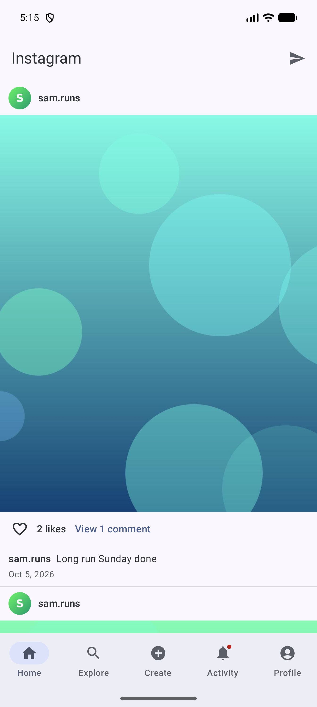
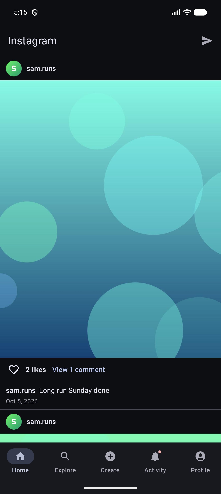
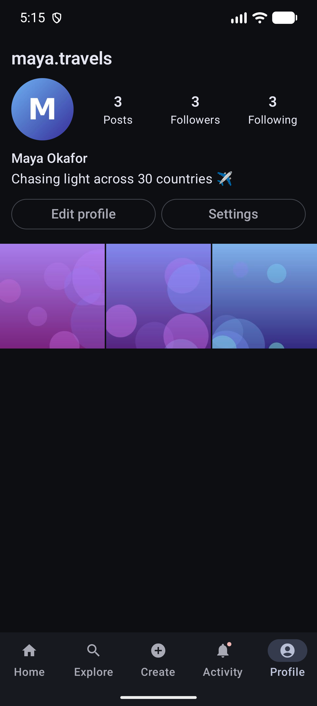
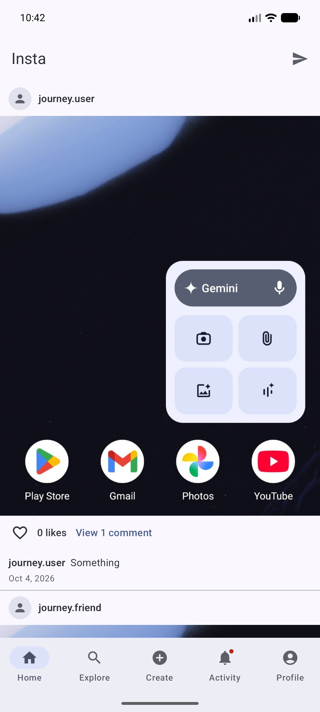
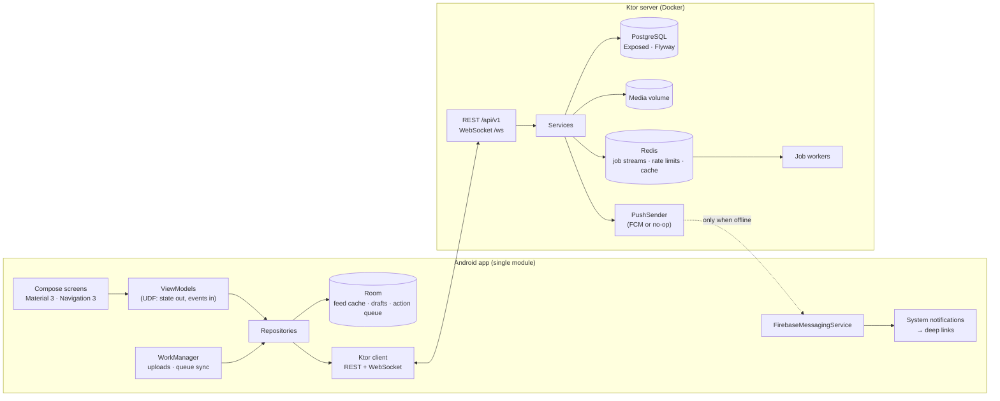

# Insta: an Instagram-style Android app with its own Kotlin backend

A portfolio project showing a modern, offline-first Android app built end to end in Kotlin: a single-activity
Jetpack Compose client and a Ktor + PostgreSQL server, with real-time messaging, push notifications and an offline
action queue.

| Feed | Dark theme | Profile (130 % font) | Activity |
|---|---|---|---|
|  |  |  |  |

## Features

- **Accounts**: Google-first. Accounts are created with Google Sign-In (Credential Manager) plus onboarding with a
  phone number verified by a one-time code; existing accounts can also sign in with phone + code. The server's
  codes are hashed, expire, are single-use and throttled. JWT access tokens with rotating refresh tokens and reuse
  detection. Changing your phone and deleting your account are confirmed with a code.
- **Posts**: single photo + caption. The server validates, strips EXIF, resizes (1080 px) and makes a thumbnail.
  Uploads run in WorkManager, with drafts kept in Room.
- **Social**: follow/unfollow, a chronological feed built at read time, likes, comments, user search (pg_trgm) and an
  explore grid.
- **Direct messages**: 1:1 real-time chat over an authenticated WebSocket, with unread counts and "Seen" receipts.
- **Notifications**: an activity feed (likes, comments, follows) with a live badge, plus FCM push when the app has no
  live socket and `insta://` deep links into the right screen.
- **Offline**: network-first Room cache for the feed, and an offline action queue for likes, comments and messages
  (optimistic UI, retried in order by WorkManager, idempotent on the server).
- **Polish**: Material 3 with dynamic colour and dark theme, edge-to-edge, adaptive navigation (bar or rail), and
  accessibility labels.

## Architecture



**Android**: single-activity Compose, MVVM with unidirectional data flow, Koin, Ktor Client + kotlinx.serialization,
Coil 3, Paging 3 (RemoteMediator), Room 3, DataStore (tokens encrypted with the Android Keystore), WorkManager,
Navigation 3 (entryProvider DSL, one back stack per tab), Credential Manager and Firebase Messaging.

**Server**: Ktor 3 (Netty), Exposed + Flyway + HikariCP on PostgreSQL 17, Koin, JWT auth, Redis 8 (Lettuce
coroutines), OpenAPI + Swagger UI, Thumbnailator/TwelveMonkeys for images and the Firebase Admin SDK. Tests use
`testApplication` and Testcontainers (Postgres + Redis).

### How background jobs and Redis fit in
- **Jobs are a transactional outbox.** A service inserts a `jobs` row in the same transaction as its data; after the
  commit the id goes onto a Redis stream (`insta:jobs:{type}`), where workers in a consumer group claim the row
  (`queued → running`), run it, and mark it done, retry it with exponential backoff, or dead-letter it.
- **Postgres decides, Redis delivers.** A reconciler re-publishes due rows (delayed jobs, retries, anything enqueued
  while Redis was down) and requeues jobs whose worker died, so a Redis restart loses nothing.
- **Rate limits** live in Redis so they hold across instances: per-IP fixed windows on the auth endpoints (fail open)
  and a sliding log per phone number for one-time codes (fail closed: no Redis, no SMS).
- **Cache**: profile counters are read through Redis and invalidated by the writes that change them.

### How the offline action queue works

1. A like, comment or message is written to Room as a `pending_action` with a client-generated UUID, and the UI
   updates immediately (optimistic).
2. A WorkManager job (`APPEND_OR_REPLACE`, network constraint, exponential backoff) drains the queue oldest-first.
   It stops at the first transient failure, so order is preserved.
3. Every endpoint is idempotent (`PUT /posts/{id}/like`, `PUT /posts/{id}/comments/{clientId}`,
   `PUT /conversations/{id}/messages/{clientId}`), so replays after a crash or timeout are safe.
4. A like → unlike → like sequence collapses to the final state before sending. A permanent rejection reverts the
   optimistic change (likes) or marks the item "Couldn't send" with Retry/Discard (comments, messages).
5. Fresh server pages are merged with still-pending likes, so the UI never flickers back.

### How notifications are delivered

A like, comment or follow writes its notification row **in the same transaction**. A repeated like or follow by the
same person collapses to one row, enforced by partial unique indexes. After the commit the server sends
`notification.new` (with the unread count) to the recipient's open WebSockets. Only if they have none does it send an
FCM data message, which the app turns into a notification on the Messages or Activity channel that deep-links to the
post, profile or conversation.

## Run it locally

Requirements: Docker Desktop, JDK 21 (Android Studio's JBR works), Android Studio or the Android SDK, and an emulator.

```sh
cp .env.example .env        # set DATABASE_PASSWORD and a JWT_SECRET of 32+ characters
docker compose up -d --build
curl localhost:8080/health  # {"status":"ok","db":"up"}; Swagger UI at http://localhost:8080/docs

# Demo data: 6 accounts with avatars, 18 posts, follows, likes, comments and a conversation
docker compose exec server java -cp "/app/lib/*" com.android.insta.server.seed.SeedKt
```

Then run the app from Android Studio, or:

```sh
adb reverse tcp:8080 tcp:8080
./gradlew :app:installDebug -Pinsta.apiBaseUrl=http://localhost:8080
```

Tap **Sign in with phone** and sign in as **maya.travels** with **+1 201-555-0101** (the other demo accounts are
`…0102` to `…0106`). Codes appear in the server log (`docker compose logs server | grep "SMS to"`); with
`OTP_DEV_ECHO=true` (set in `.env.example` for local use) debug builds also show the code on screen.

Creating new accounts needs Google Sign-In (OAuth client IDs); FCM push is optional. Setup steps are in
[`docs/running-the-app.md`](docs/running-the-app.md).

## Tests

```sh
cd server && ./gradlew test                                   # 51 tests: routes, Google + phone OTP auth, media, chat/WebSocket, push, seeding (Testcontainers)
./gradlew :app:testDebugUnitTest :app:lintDebug               # 89 tests: ViewModels, repositories, queue, navigation, phone numbers, Koin graph
./gradlew :app:connectedDebugAndroidTest                      # Room DAO tests on a device
```

CI (`.github/workflows/ci.yml`) runs the server suite and Android lint, unit tests and a debug build on every push
and pull request.

End-to-end flows were also checked on an emulator for every milestone; the scripts and results are in
[`journeys/`](journeys).

## Repository layout

```
app/        Android client (feature packages: auth, feed, post, profile, explore, engagement, chat, notifications, settings)
server/     Ktor server (auth, users, media, posts, social, chat, notifications, seed) + Flyway migrations + OpenAPI
docs/       Implementation plan with per-milestone decisions, run instructions
journeys/   Emulator journey scripts and results (screenshots)
```

## Design decisions worth a look

- **Idempotent writes with client UUIDs**: make the offline queue and retries safe.
- **Keyset pagination** (`created_at, id`) with opaque cursors everywhere.
- **Refresh-token rotation with family revocation**: a reused refresh token kills the whole session.
- **Socket first, push second**: a foreground app gets real-time events; FCM is only for the background.
- **Firebase is optional on both sides**: the stack runs without any third-party accounts.
- **Account deletion** cascades through foreign keys, fixes counters on other people's posts and removes media files
  only after the transaction commits.

See [`docs/IMPLEMENTATION_PLAN.md`](docs/IMPLEMENTATION_PLAN.md) for the v2 milestone plan ([`docs/SPEC.md`](docs/SPEC.md)) and [`docs/v1/IMPLEMENTATION_PLAN.md`](docs/v1/IMPLEMENTATION_PLAN.md) for v1 and every deviation from it.
